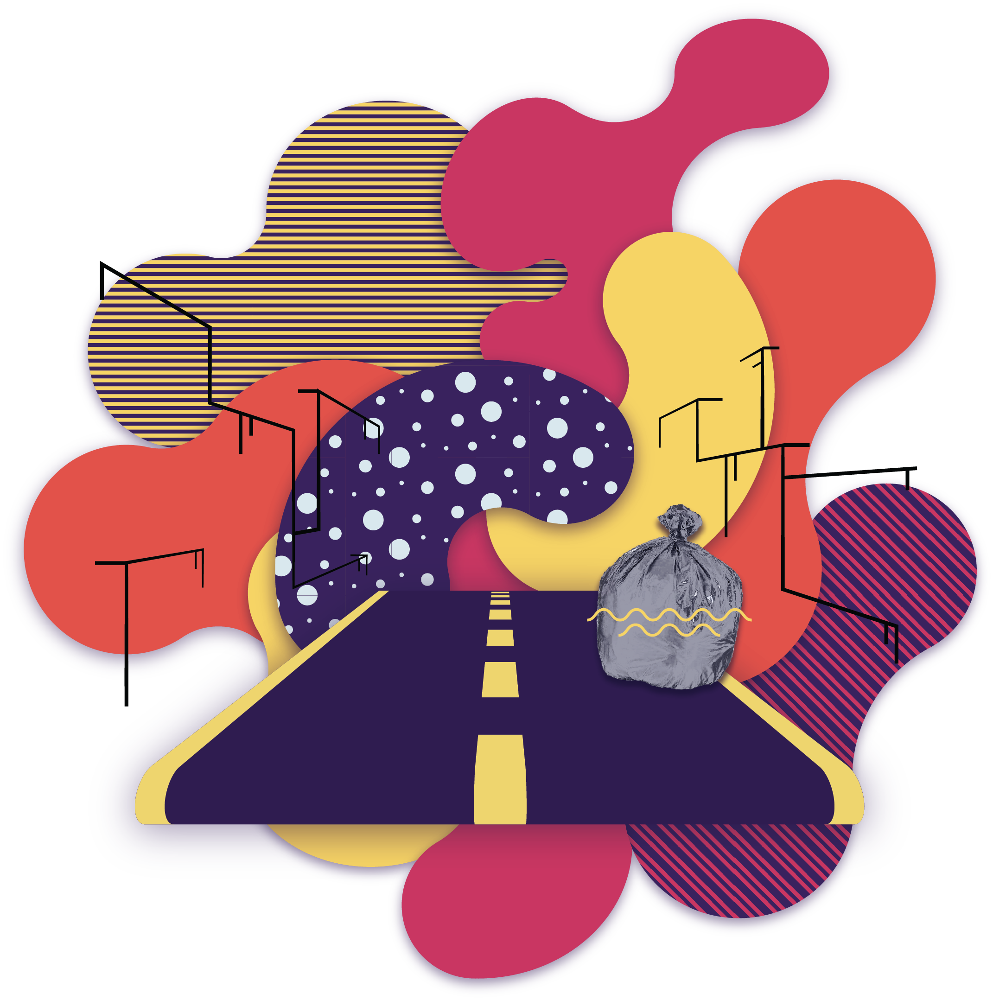

# Object Detection Kit (ODK)



ODK is a easy way to start detecting trained objects on images. By using the Scan App, frames can be captured and send to a central hub. From there they can be sent to the brains of the kit, the Frame Analyzer. Using the open source [YOLO technology by Ultralytics](https://github.com/ultralytics/yolov5) desired objects can be recognized, this information will end up in a database in real-time. The data is then ready to be used for e.g. real-time analytics.

ODK is a project by the innovation team of the [City of Amsterdam](https://www.amsterdam.nl/wonen-leefomgeving/innovatie/). For more information about the project check [odk.ai](https://www.odk.ai).

## Contents

This repository contains the core elements of the ODK project: 

- **[ODK Scan App](odk-app/README.md)**: VueJS PWA for streaming frames to the API

- **[ODK API](odk-api/README.md)**: Handles incoming via WebSocket and REST, sets up necessary communication channels with the frame analyzer and sends data to the database, supported by:
	- RabbitMQ message broker
	- PostgreSQL database

- **[ODK Frame Analyzer](https://gitlab.com/odk/odk-frame-analyzer)**: Worker with a trained YOLO model for recognized specific objects and returning relevant data to a queue

## Getting started

To get the whole stack up and running quickly follow these steps. To run/debug each element separately, see the README files in their respective folders.

### Requirements

- Docker (Node, Python, Postgres, RabbitMQ)
- Python 3 (python3-venv)
- (optional) [CUDA Toolkit](https://docs.nvidia.com/cuda/cuda-installation-guide-linux/)

### Setup

Clone repository with submodules:
```
$ git clone https://gitlab.com/odk/odk-stack.git
$ cd odk-stack
$ git submodule update --init --recursive
```

_(TODO)_ Get sample trained model:
```
$ cd odk-frame-analyzer
$ ./download_sample_model.sh
```

### Running locally

First start the database and message broker, wait a few seconds until their startup is complete:
```
$ docker-compose up -d db rmq
```

Then start up the app and API:
```
$ docker-compose up -d app api
```

Run `docker ps` to check the port bindings for each element.

Then start the frame analyzer:
```
$ cd odk-frame-analyzer
$ python3 -m venv venv
$ source venv/bin/activate
$ pip install -r requirements.txt
$ python MlWorker.py
```

Scan App can now be accessed here: [localhost:8000/pwa](http://localhost:8000/client)
 
API documentation & testing: [localhost:8080/docs](http://localhost:8080/docs)

## Tools

### Code base

- [Python](https://www.python.org/) for API & Frame Analyzer
- [VueJS](https://vuejs.org/) for App & Dashboard

### Machine learning

- [YOLOv5](https://github.com/ultralytics/yolov5/) for Object Detection

### Libraries API

- [FastAPI](https://fastapi.tiangolo.com/) for REST + WebSocket
- [aio-pika](https://aio-pika.readthedocs.io/en/latest/) for RabbitMQ communication
- [Uvicorn](https://www.uvicorn.org/) as ASGI server
- [Starlette](https://www.starlette.io/) as ASGI framework/toolkit

### Libraries app

_TODO_

### Infrastructure

- [Docker](https://www.docker.com/) for deployment of services
- [PostgreSQL](https://www.postgresql.org) database
- [RabbitMQ](https://www.rabbitmq.com/) message broker