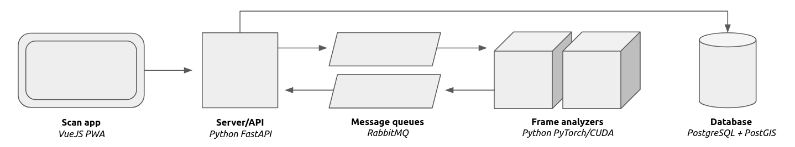

# ODK API

This API is the backbone of the ODK kit, receiving images from the eyes (scan app) and sending it to the brain (frame analyzer). Its a simple application exposing a hand full of endpoints (WebSocket and REST) for the app to talk to, next to some endpoints for other processes to communicate images through.

Apart from exposing endpoints it also manages the connection to the PostgreSQL database and initiates the needed queues on the RabbitMQ message broker.

Written using [FastAPI](https://fastapi.tiangolo.com/)!

## Data flow

The data flow goes as follows:

1. App captures image
2. App send image + meta data to API
3. API validates data and places it on a queue
3. Frame analyzer reads the data from the queue
4. FA (possibly) detects object(s) on image
5. FA places meta data on queue
6. API reads queue from FA and persists data on database

## Architecture



## Getting started

### Services
```
$ docker-compose -f ../docker-compose.yml up -d db rmq
```

### Docker

```
$ docker-compose up -d api
```

### Python

Setup virtual environment:
```
$ python3 -m venv venv
$ source venv/bin/activate
$ pip install -r requirements.txt
```

Run single worker:
```
$ ./uvicorn_run.sh
```

Run multiple workers:
```
$ ./gunicorn_run.sh
```

## Usage

Since its build with FastAPI two forms of documentation are included:
- `http://localhost:8080/docs`
- `http://localhost:8080/redoc`

For easier user management there is modified version of [Tiangolo's user dashboard](https://github.com/tiangolo/full-stack-fastapi-postgresql):
https://gitlab.com/odk/user-management-dashboard
