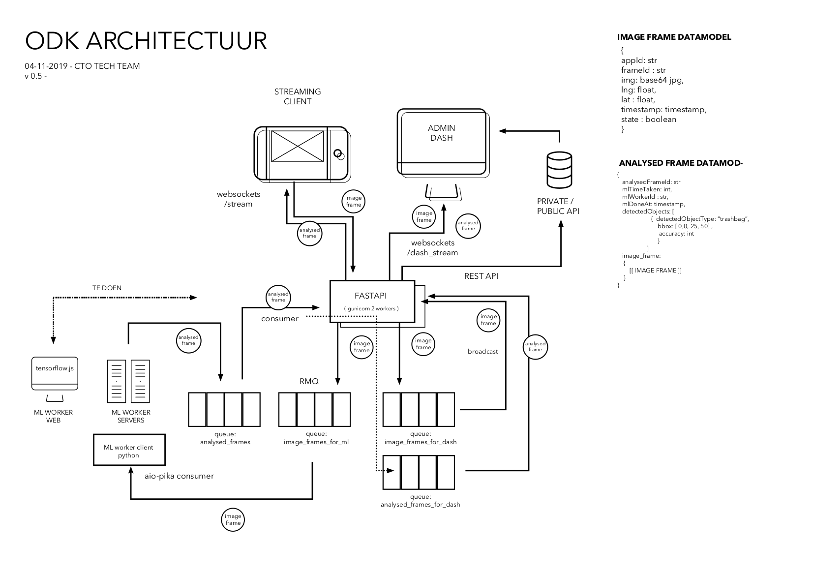

# ODK API

The API is the core of the ODK pipeline setting up necesarry REST and websocket endpoints, RabbitMQ message queues and communicating with the PostgreSQL database.



## Getting started

### Requirements

- Python (tested with v3.7)

### Setup & run

Setup virtual environment:
```
$ python3 -m venv venv
$ source venv/bin/active (Linux)
$ venv\Scripts\activate (Windows)
(venv) $ pip install -r requirements.txt
(venv) $ python main.py
```