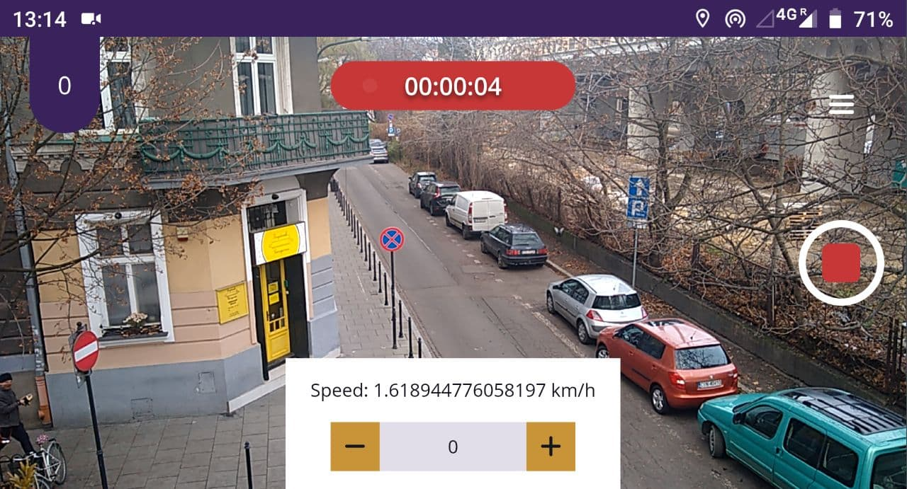

# ODK Scan App

This app is the eyes of the ODK kit. Its easy to install on a Android phone without having to go through an app store since its a Progressive Web App (PWA). Its works best and it continuously tested in Chrome.



After installing the app and opening it, there is an option to log in. This way its easy to verify to validity of frames coming in. During the setup process the user is made aware of the high amount of data usage streaming can cause. After the the user accepts the sharing of the devices location and camera, the user can start a stream. There are a few features build in to get the highest quality of data:

- High GPS accuracy is enabled
- When streaming in a car, a minimal speed for capturing frames can be set
- The screen stays active so the streaming doesn't stop

## Getting started

Building and running the app is straight forward, only its main focus is mobile devices being held in landscape mode. For the best experience on a desktop, enable the device toolbar in the developer settings and select a phone in landscape mode.

### Requirements

- Node (tested with v12.19.0)
- NPM

### Running locally

Install NPM packages:
```
$ npm install
```

Run locally:
```
$ npm run serve
```

Build:
```
$ npm run build
```

## Usage

For user management see the ODK API documentation.